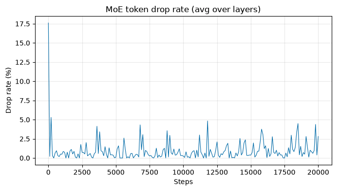

# LLM from Scratch

[](LICENSE)
[](https://www.python.org/)
[](https://pytorch.org/)

A from-scratch PyTorch implementation of a modern decoder-only LLM, including both **dense** and **sparse (MoE)** variants, trained on [TinyStories](https://huggingface.co/datasets/roneneldan/TinyStories).
This is an educational repository focused on understanding, implementing, and experimenting with the core components of an LLM, rather than treating the model as a black box.

---

## Technical blogs

The posts below walk through the codebase and its implementation in detail:

- [LLM From Scratch 1: Training a Dense LLM](https://iraban-dutta.github.io/from-first-principles/posts/llm4mscratch1_training-a-dense-llm/) — architecture choices, data pipeline, training loop, TinyStories run, throughput
<!--
- [LLM From Scratch 2: KV Cache and Attention Variants](https://iraban-dutta.github.io/from-first-principles/posts/llm4mscratch2_kvcache-attention-variants/) — inference, KV cache, MHA / GQA / MQA / MHLA
- [LLM From Scratch 3: RoPE — Rotary Position Embedding](https://iraban-dutta.github.io/from-first-principles/posts/llm4mscratch3_rope/) — RoPE math, vectorized implementation, integration with MHA, GQA, and MHLA
- [LLM From Scratch 4: Mixture-of-Experts (Part 1)](https://iraban-dutta.github.io/from-first-principles/posts/llm4mscratch4_moe1/) — MoE architecture, capacity, load balancing, DeepSeek-style aux-loss-free routing, sparse TinyStories run
- [LLM From Scratch 5: Mixture-of-Experts (Part 2)](https://iraban-dutta.github.io/from-first-principles/posts/llm4mscratch5_moe2/) — dense vs sparse throughput, profiling, vectorized dispatcher
-->

---

## What this repo implements

| Area | Implemented |
|------|-------------|
| **Attention** | MHA, GQA, MQA, MHLA (DeepSeek-V2 style). |
| **Positional information** | Absolute positional information — (sinusoidal and learned), and relative positional information through RoPE. |
| **Normalization** | Pre-norm Transformer blocks with LayerNorm. |
| **Feed-forward** | Dense GELU MLP or sparse Mixture-of-Experts (MoE) layers. |
| **Mixture-of-Experts** | Top-*k* expert routing, capacity management, shared experts, noisy routing, auxiliary-loss-based load balancing, and auxiliary-loss-free balancing using dynamic expert biases (DeepSeek-V3 style). |
| **Data pipeline** | End-to-end pipeline for downloading TinyStories from the Hugging Face Hub, tokenization, binary storage using `memmap`, and batched data loading for training. |
| **Training pipeline** | End-to-end training with AdamW, decoupled weight decay, learning-rate warmup and cosine decay, gradient clipping, validation, checkpointing, checkpoint resume, and MoE routing metrics. |
| **Inference pipeline** | KV caching, sliding-context inference, greedy/random/top-*k* sampling, and cached vs. naive generation benchmarking. |
| **Benchmarking** | Training throughput and batch-size sweeps, dense vs MoE performance, forward/backward/optimizer time breakdowns, MoE routing and dispatch profiling, and naive vs vectorized dispatch comparisons. |

---

## Project structure

```
llm-from-scratch/
├── config/
│   ├── constants.py               
│   ├── dense_default.py              # dense TinyStories run
│   └── moe_default.py                # sparse TinyStories run
│
├── main/                             # CLI entry points (python -m ...)
│   ├── download_preprocess.py        # script to download data, tokenize and dump it in local disk
│   ├── train.py                      # script to trigger training
│   ├── infer.py                      # script to trigger inference
│   ├── train_benchmark.py            # script to check tokens/s of a full train step
│   ├── train_benchmark_detailed.py   # script to profile dense vs sparse train time in detail 
│   └── tune_moe_routing.py           # script that runs a short sweep over balancing configs
│
├── src/
│   ├── model/
│   │   ├── llm.py                    # Transformer + weight tying + init
│   │   ├── llm_config.py             # LLMConfig + validation
│   │   ├── layers.py                 # pre-norm decoder block
│   │   ├── attention.py              # MHA, GQA, MHLA
│   │   ├── position_embedding.py     # sinusoidal, learned, RoPE
│   │   ├── moe.py                    # dense MLP + MoE (route / dispatch / combine)
│   │   └── normalization.py          # LayerNorm
│   ├── data/                      
│   │   ├── downloader.py             # TinyStories download
│   │   ├── preprocessor.py           # Saving as .bin file
│   │   ├── tokenizer.py              # GPT-2 tokenize
│   ├── training/
│   │   ├── trainer.py                # dataloader, train-loop, AdamW, cosine LR, checkpointing, logs
│   │   └── moe_routing_metrics.py
│   └── inference/
│       ├── cache.py                  # KV cache (prefill, decode, sliding window)
│       └── generate.py               # sampling + naive vs cached generate
│
├── data/                             # dump raw data from HF and tokenized data as .bin file 
├── logs/                             # per-run config.json, train.log, moe_stats.csv
└── checkpoints/                      # best.pt, latest.pt

```

---

## Setup

```bash
git clone https://github.com/iraban-dutta/llm-from-scratch.git
cd llm-from-scratch

python3.11 -m venv .venv
source .venv/bin/activate

pip install -r requirements.txt
```

---

## Running the project

### 1. Prepare the dataset

```bash
# Download and tokenize TinyStories
python -m main.download_preprocess
```

### 2. Train

```bash
# Dense model
python -m main.train --config config.dense_default

# Sparse (MoE) model
python -m main.train --config config.moe_default

# Check CLI structure
python -m main.train --help

# Train with CLI overrides
python -m main.train --config config.dense_default \
  --batch-size 16 \
  --lr 6e-4 \
  --log-interval 10 \
  --eval-interval 200 \
  --checkpoint-interval 1000
```

### 3. Resume training

```bash
# Resume from the latest checkpoint
# Model config is restored from the checkpoint, not from `--config`
# Trainer config can still be overridden.
python -m main.train \
  --resume checkpoints/<run>/latest.pt \
  --log-interval 10 \
  --eval-interval 100 \
  --checkpoint-interval 1000
```

### 4. Run inference

```bash
# Check CLI structure
python -m main.infer --help

# Generate text from a randomly initialized model
python -m main.infer --config config.dense_default --prompt "Hey, hi"

# Generate text from a trained checkpoint
python -m main.infer \
  --ckpt checkpoints/<run>/best.pt \
  --prompt "Once upon a time" \
  --max-new-tokens 50 \
  --strategy topk \
  --temperature 1.0 \
  --top-k 50

# Benchmark cached vs. naive inference
python -m main.infer \
  --ckpt checkpoints/<run>/best.pt \
  --benchmark
```

### 5. Benchmark training performance

```bash
# ================================
# train_benchmark.py
# ================================
# Short timed train-step loop (warmup + synced device) for picking batch size before a long run
python -m main.train_benchmark --config config.dense_default

# Compare a different batch size
python -m main.train_benchmark \
  --config config.dense_default \
  --batch-size 16

# ================================
# train_benchmark_detailed.py
# ================================
# Dense vs MoE TPUT: Detailed forward / backward / optimizer time breakdown
# Toggles are at the top of main/train_benchmark_detailed.py: (USE_MOE, USE_VECTORIZED_DISPATCH, TOPK, CAPACITY_FACTOR)
python -m main.train_benchmark_detailed
```

### 6. Tune MoE load balancing

```bash
# Short sweep to find the best hyperparameters for load balance.
# Writes routing plots and a ranking table (CV, max-load, drop rate, loss).
python -m main.tune_moe_routing

# Analyze an existing sweep
python -m main.tune_moe_routing \
  --analyze-only logs/moe_routing_tune/<run>
```

---

## Configs

### Default configs

Two reference configurations are provided:

| Configuration | Description |
|---|---|
| dense_default.py | Dense decoder-only Transformer, as shown in the figure below |
| moe_default.py | Same architecture with a sparse MoE layer in the FFN block |


### Supported Model knobs

The following options can be combined to build different Transformer architectures:

| Component | Configuration | Options / Effect |
|-----------|---------------|------------------|
| **Model size** | d_model, n_layer, ctx_len | Controls model width, depth, and context length |
| **FFN** | ff_ratio | FFN expansion relative to d_model |
| **Attention** | attention | mha, gqa, or mhla |
| **Attention heads** | n_heads | Number of query heads |
| **KV groups** | n_groups | Number of KV groups; 1 gives MQA, n_heads gives MHA, and intermediate values give GQA |
| **Position** | position_embedding | sinusoidal, learned, or identity |
| **RoPE** | rotary_embedding | Enables Rotary Position Embeddings and overrides position_embedding with identity |
| **MHLA** | d_latent1, d_latent2, d_headR | Latent dimensions and RoPE subspace used by MHLA |
| **Normalization** | normalization | LayerNorm |
| **Attention implementation** | use_flash | True → PyTorch SDPA kernels; False → explicit attention computation |
| **MoE** | use_moe | False → dense MLP; True → sparse MoE |
| **Experts** | n_experts, topk | Number of experts and experts selected per token |
| **Capacity** | capacity_factor | Controls the maximum number of tokens assigned to each expert |
| **Shared experts** | n_shared_experts | Number of experts that always process every token |
| **Noisy routing** | noisy_router, router_noise_std | Adds Gaussian noise to router logits during training |
| **Load balancing** | scale_aux_loss_expert_imp | Auxiliary loss for balancing expert importance |
| **Load balancing** | scale_aux_loss_load_balance | Auxiliary loss for balancing expert load |
| **Loss-free balancing** | aux_loss_free_load_balance | Enables auxiliary-loss-free balancing using dynamic expert biases |
| **Bias update** | aux_loss_free_load_balance_bias_update | Controls the update rate of the expert biases |
| **Dispatch** | use_vectorized_dispatch | Vectorized token dispatch vs a naive per-expert implementation |

### Default values for Model knobs

| | Dense | MoE |
|---|---:|---:|
| Vocabulary size | 50,304 | 50,304 |
| Context length | 128 | 128 |
| `d_model` | 512 | 512 |
| Layers | 8 | 8 |
| Attention | GQA | GQA |
| Query heads | 8 | 8 |
| KV groups | 4 | 4 |
| Position | RoPE | RoPE |
| Normalization | LayerNorm | LayerNorm |
| FFN | Dense GELU MLP | 4 experts, top-1 |
| Capacity factor | — | 1.25 |
| Load balancing | — | Auxiliary-loss-free |
| Expert bias update | — | 0.05 |

### Supported Trainer knobs and default values

Trainer settings can also be overridden from the command line without changing the model architecture.

| Parameter | Default | Description |
|-----------|---------|-------------|
| num_steps | 20,000 | Number of optimizer steps |
| batch_size | 8 | Sequences per batch |
| learning_rate | 6e-4 | Peak learning rate |
| min_lr | 6e-5 | Final learning rate after cosine decay |
| warmup_steps | 15 | Linear warmup steps |
| weight_decay | 0.01 | AdamW weight decay |
| beta1, beta2 | 0.9, 0.95 | AdamW momentum parameters |
| grad_clip | 1.0 | Maximum global gradient norm |
| eval_interval | 200 | Steps between validation runs |
| eval_steps | 16 | Validation batches per evaluation |
| checkpoint_interval | 1,000 | Steps between checkpoints |
| device | auto | CUDA → MPS → CPU |

---

## Experiments and Results

Both training runs use B=8, T=128, 20k steps, **20.5M tokens**, seed 42, and Apple M1 8GB (MPS). The initial loss is close to $\log V \approx 10.83$.

### Dense LLM on TinyStories (~50M parameters)

| | Dense |
|---|---:|
| FFN | Dense MLP |
| Train loss @ 20k | 2.041 |
| Val loss @ 20k | 2.044 |
| **Best val loss** | **2.034** (step 19,400) |
| Train TPUT | ~2.0k tok/s |

Train and validation loss decrease together throughout the run.


### Sparse (MoE) LLM on TinyStories (~100M parameters)

| | Sparse MoE |
|---|---:|
| FFN | 4 experts, top-1, CF=1.25 |
| Train loss @ 20k | 2.141 |
| Val loss @ 20k | 2.176 |
| **Best val loss** | **2.160** |
| Train TPUT | ~1.2k tok/s |


#### Token routing stats

Routing metrics are aggregated across all 8 decoder layers. After the initial transient:

| Metric | Description | Result |
|---|---|---:|
| **Routing CV** | Coefficient of variation of tokens routed to each expert; lower means more balanced routing | settles to 0.15–0.20 |
| **Maximum load ratio** | Maximum expert load relative to its fair-share load; 1.0× is perfectly balanced | settles at ~1.2× |
| **Token drop rate** | Fraction of tokens exceeding expert capacity | settles to <1% |




#### Naive vs vectorized dispatch

An apples-to-apples training-step benchmark was run with B=8, T=128, 4 experts, top-1 routing, and **CF=4** to avoid token dropping as a confounding factor. Results use 300 warmup steps and 200 timed steps, with median timings and device synchronization.

The benchmark identified **MoE dispatch as a primary training bottleneck**, motivating the implementation of a vectorized approach which improved the final TPUT.

| Run | Median step | TPUT |
|-----|------------:|-----:|
| Dense | 428 ms | **2,390 tok/s** |
| Sparse, naive dispatch | 1,057 ms | 969 tok/s |
| Sparse, vectorized dispatch | 919 ms | **1,114 tok/s** |

The naive dispatcher spends **51% of MoE forward time** in per-expert torch.where. Vectorizing dispatch makes this phase **2.6× faster** (234 ms → 89 ms) and the overall MoE forward pass **1.6× faster**. End-to-end training throughput improves from **969 → 1,114 tok/s (1.15×)**.


### Dense vs MoE: A Note on the Results

- **Same training budget:** Both models were trained with the same setup on **20.5M TinyStories tokens**.
- **Validation loss:** The dense model achieves a slightly better best validation loss (**2.034 vs. 2.160**).
- **Why MoE does not show an advantage here:** At this relatively small model and training scale, the benefits of sparse expert specialization are unlikely to fully emerge.
- **Dataset:** TinyStories is also not sufficiently large or diverse to fully exploit the specialization that MoE architectures are designed to provide.
- **Purpose of the MoE implementation:** The focus was on understanding the **MoE architecture, sparse expert routing, capacity management, and load balancing**, while achieving stable training of a sparse LLM.

---

## Citation

```bibtex
@software{llm_from_scratch,
  title  = {LLM from Scratch},
  author = {Dutta, Iraban},
  year   = {2026},
  url    = {https://github.com/iraban-dutta/llm-from-scratch},
  note   = {Decoder-only Transformer in PyTorch: MHA/GQA/MHLA, RoPE, KV cache, dense and MoE, train run on TinyStories}
}
```
