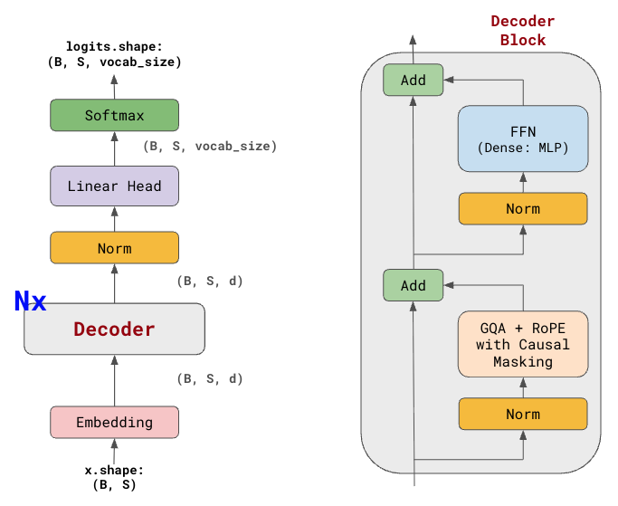
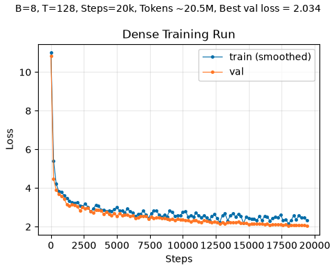
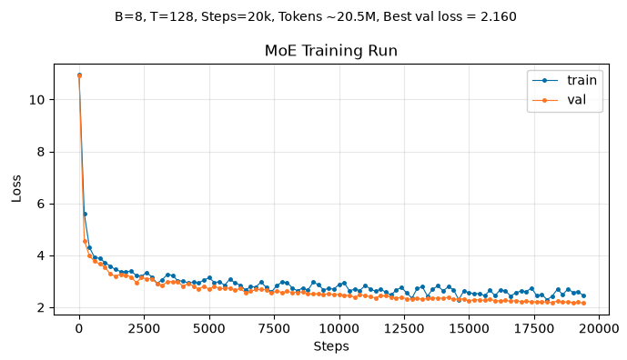
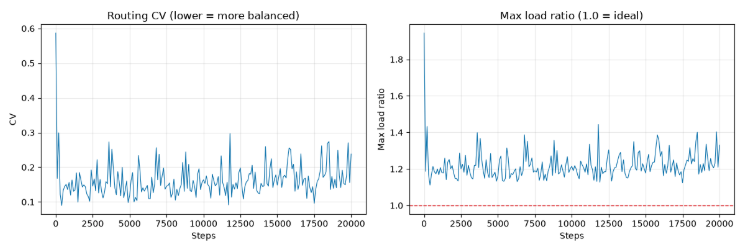
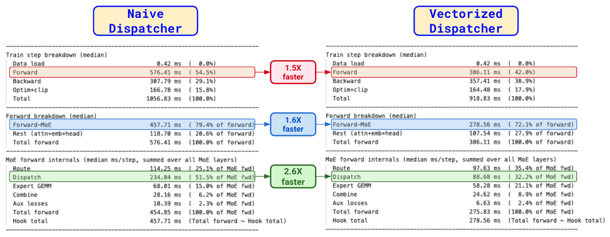

# LLM from Scratch

[](LICENSE)
[](https://www.python.org/)
[](https://pytorch.org/)

A from-scratch PyTorch implementation of a modern decoder-only LLM, including both **dense** and **sparse (MoE)** variants, trained on [TinyStories](https://huggingface.co/datasets/roneneldan/TinyStories).
This is an educational repository focused on understanding, implementing, and experimenting with the core components of an LLM, rather than treating the model as a black box.

---

## Technical blogs

The posts below walk through the codebase and its implementation in detail:

- [LLM From Scratch 1: Training a Dense LLM](https://iraban-dutta.github.io/from-first-principles/posts/llm4mscratch1_training-a-dense-llm/) — architecture choices, data pipeline, training loop, TinyStories run, throughput
<!--
- [LLM From Scratch 2: KV Cache and Attention Variants](https://iraban-dutta.github.io/from-first-principles/posts/llm4mscratch2_kvcache-attention-variants/) — inference, KV cache, MHA / GQA / MQA / MHLA
- [LLM From Scratch 3: RoPE — Rotary Position Embedding](https://iraban-dutta.github.io/from-first-principles/posts/llm4mscratch3_rope/) — RoPE math, vectorized implementation, integration with MHA, GQA, and MHLA
- [LLM From Scratch 4: Mixture-of-Experts (Part 1)](https://iraban-dutta.github.io/from-first-principles/posts/llm4mscratch4_moe1/) — MoE architecture, capacity, load balancing, DeepSeek-style aux-loss-free routing, sparse TinyStories run
- [LLM From Scratch 5: Mixture-of-Experts (Part 2)](https://iraban-dutta.github.io/from-first-principles/posts/llm4mscratch5_moe2/) — dense vs sparse throughput, profiling, vectorized dispatcher
-->

---

## What this repo implements

| Area | Implemented |
|------|-------------|
| **Attention** | MHA, GQA, MQA, MHLA (DeepSeek-V2 style). |
| **Positional information** | Absolute positional information — (sinusoidal and learned), and relative positional information through RoPE. |
| **Normalization** | Pre-norm Transformer blocks with LayerNorm. |
| **Feed-forward** | Dense GELU MLP or sparse Mixture-of-Experts (MoE) layers. |
| **Mixture-of-Experts** | Top-*k* expert routing, capacity management, shared experts, noisy routing, auxiliary-loss-based load balancing, and auxiliary-loss-free balancing using dynamic expert biases (DeepSeek-V3 style). |
| **Data pipeline** | End-to-end pipeline for downloading TinyStories from the Hugging Face Hub, tokenization, binary storage using `memmap`, and batched data loading for training. |
| **Training pipeline** | End-to-end training with AdamW, decoupled weight decay, learning-rate warmup and cosine decay, gradient clipping, validation, checkpointing, checkpoint resume, and MoE routing metrics. |
| **Inference pipeline** | KV caching, sliding-context inference, greedy/random/top-*k* sampling, and cached vs. naive generation benchmarking. |
| **Benchmarking** | Training throughput and batch-size sweeps, dense vs MoE performance, forward/backward/optimizer time breakdowns, MoE routing and dispatch profiling, and naive vs vectorized dispatch comparisons. |

---

## Project structure

```
llm-from-scratch/
├── config/
│   ├── constants.py               
│   ├── dense_default.py              # dense TinyStories run
│   └── moe_default.py                # sparse TinyStories run
│
├── main/                             # CLI entry points (python -m ...)
│   ├── download_preprocess.py        # script to download data, tokenize and dump it in local disk
│   ├── train.py                      # script to trigger training
│   ├── infer.py                      # script to trigger inference
│   ├── train_benchmark.py            # script to check tokens/s of a full train step
│   ├── train_benchmark_detailed.py   # script to profile dense vs sparse train time in detail 
│   └── tune_moe_routing.py           # script that runs a short sweep over balancing configs
│
├── src/
│   ├── model/
│   │   ├── llm.py                    # Transformer + weight tying + init
│   │   ├── llm_config.py             # LLMConfig + validation
│   │   ├── layers.py                 # pre-norm decoder block
│   │   ├── attention.py              # MHA, GQA, MHLA
│   │   ├── position_embedding.py     # sinusoidal, learned, RoPE
│   │   ├── moe.py                    # dense MLP + MoE (route / dispatch / combine)
│   │   └── normalization.py          # LayerNorm
│   ├── data/                      
│   │   ├── downloader.py             # TinyStories download
│   │   ├── preprocessor.py           # Saving as .bin file
│   │   ├── tokenizer.py              # GPT-2 tokenize
│   ├── training/
│   │   ├── trainer.py                # dataloader, train-loop, AdamW, cosine LR, checkpointing, logs
│   │   └── moe_routing_metrics.py
│   └── inference/
│       ├── cache.py                  # KV cache (prefill, decode, sliding window)
│       └── generate.py               # sampling + naive vs cached generate
│
├── data/                             # dump raw data from HF and tokenized data as .bin file 
├── logs/                             # per-run config.json, train.log, moe_stats.csv
└── checkpoints/                      # best.pt, latest.pt

```

---

## Setup

```bash
git clone https://github.com/iraban-dutta/llm-from-scratch.git
cd llm-from-scratch

python3.11 -m venv .venv
source .venv/bin/activate

pip install -r requirements.txt
```

---

## Running the project

### 1. Prepare the dataset

```bash
# Download and tokenize TinyStories
python -m main.download_preprocess
```

### 2. Train

```bash
# Dense model
python -m main.train --config config.dense_default

# Sparse (MoE) model
python -m main.train --config config.moe_default

# Check CLI structure
python -m main.train --help

# Train with CLI overrides
python -m main.train --config config.dense_default \
  --batch-size 16 \
  --lr 6e-4 \
  --log-interval 10 \
  --eval-interval 200 \
  --checkpoint-interval 1000
```

### 3. Resume training

```bash
# Resume from the latest checkpoint
# Model config is restored from the checkpoint, not from `--config`
# Trainer config can still be overridden.
python -m main.train \
  --resume checkpoints/<run>/latest.pt \
  --log-interval 10 \
  --eval-interval 100 \
  --checkpoint-interval 1000
```

### 4. Run inference

```bash
# Check CLI structure
python -m main.infer --help

# Generate text from a randomly initialized model
python -m main.infer --config config.dense_default --prompt "Hey, hi"

# Generate text from a trained checkpoint
python -m main.infer \
  --ckpt checkpoints/<run>/best.pt \
  --prompt "Once upon a time" \
  --max-new-tokens 50 \
  --strategy topk \
  --temperature 1.0 \
  --top-k 50

# Benchmark cached vs. naive inference
python -m main.infer \
  --ckpt checkpoints/<run>/best.pt \
  --benchmark
```

### 5. Benchmark training performance

```bash
# ================================
# train_benchmark.py
# ================================
# Short timed train-step loop (warmup + synced device) for picking batch size before a long run
python -m main.train_benchmark --config config.dense_default

# Compare a different batch size
python -m main.train_benchmark \
  --config config.dense_default \
  --batch-size 16

# ================================
# train_benchmark_detailed.py
# ================================
# Dense vs MoE TPUT: Detailed forward / backward / optimizer time breakdown
# Toggles are at the top of main/train_benchmark_detailed.py: (USE_MOE, USE_VECTORIZED_DISPATCH, TOPK, CAPACITY_FACTOR)
python -m main.train_benchmark_detailed
```

### 6. Tune MoE load balancing

```bash
# Short sweep to find the best hyperparameters for load balance.
# Writes routing plots and a ranking table (CV, max-load, drop rate, loss).
python -m main.tune_moe_routing

# Analyze an existing sweep
python -m main.tune_moe_routing \
  --analyze-only logs/moe_routing_tune/<run>
```

---

## Configs

Default run configs live in `config/`. Pass them as a Python module path to `--config`:

| File | Module | What it is |
|------|--------|------------|
| `config/dense_default.py` | `config.dense_default` | Dense TinyStories run |
| `config/moe_default.py` | `config.moe_default` | Same backbone, `use_moe=True` |
| `config/constants.py` | — | Vocab size, data paths, tokenizer / sampling enums |

Each file defines an `LLMConfig` (architecture) and an `LLMTrainerConfig` (optimizer, schedule, logging, checkpoints). CLI flags on `main.train` override the **trainer** only (batch size, LR, log/eval/ckpt intervals). Model shape always comes from the config module, or from the checkpoint on `--resume`.

Both defaults share this backbone. The only FFN difference is dense MLP vs 4-expert MoE.



*Left: full Transformer. Right: one pre-norm decoder block. Default TinyStories run uses GQA + RoPE + dense MLP (or MoE in `config.moe_default`).*

| Choice | Dense (`config.dense_default`) | Sparse (`config.moe_default`) |
|--------|-------------------------------|-------------------------------|
| Vocab | 50304 (GPT-2 BPE, padded to a multiple of 128) | same |
| Context `T` | 128 | same |
| `d_model` | 512 | same |
| Layers | 8 | same |
| Attention | GQA, 8 query heads, 4 KV groups | same |
| Head dim | 64 | same |
| Position | RoPE | same |
| FFN | Dense MLP, `ff_ratio=4` → `d_ff=2048`, GELU, no bias | MoE: 4 experts, top-1, CF=1.25 |
| Load balancing | — | Aux-loss-free, γ = 0.05 |
| Norm | LayerNorm, pre-norm | same |
| Weight tying | Embedding tied to LM head | same |
| Dropout / bias | 0 / False | same |
| Parameters | ~50M (all active) | ~99M total, ~50M active (top-1) |

Weight tying shares one $V \times d_{\text{model}}$ matrix between the token embedding and the LM head. Pre-norm leaves the residual stream unnormalized, so the attention and FFN output projections are initialized with std $1/\sqrt{2L}$ ($L$ layers, two residual writes per block) to keep residual-stream variance from growing with depth.

### Model knobs

Architecture is the dataclass `LLMConfig` in `src/model/llm_config.py`. Changing a field changes the block that gets built:

| Field | Options / typical values | Architecture you get |
|-------|--------------------------|----------------------|
| `d_model`, `n_layer`, `ctx_len`, `ff_ratio` | e.g. 512, 8, 128, 4 | Width, depth, context, FFN expansion |
| `attention` | `mha` | Multi-Head Attention: one KV head per query head |
| `attention` | `gqa` | Grouped-Query Attention: `n_groups` KV heads shared across query heads |
| `n_groups` | e.g. 4; `1`; `n_heads` | With GQA: 4 KV groups (default); **MQA** if `1`; MHA-equivalent if `n_groups = n_heads` |
| `attention` | `mhla` | Multi-Head Latent Attention (DeepSeek-V2): KV/Q compressed through latents |
| `d_latent1`, `d_latent2`, `d_headR` | MHLA only | Down-projected KV / Q latents, and the RoPE subspace dim |
| `n_heads` | e.g. 8 | Query heads (`d_model` must divide evenly) |
| `rotary_embedding` | `True` / `False` | RoPE on Q/K. Forces `position_embedding="identity"` |
| `position_embedding` | `sinusoidal` · `learned` · `identity` | Absolute PE when RoPE is off |
| `use_flash` | `True` / `False` | PyTorch SDPA kernels vs explicit $QK^{\top}$ attention |
| `use_moe` | `False` | Dense GELU MLP in every decoder block |
| `use_moe` | `True` | Sparse MoE layer instead of that MLP |
| `n_experts`, `topk` | e.g. 4, 1 | Expert pool and how many experts fire per token |
| `capacity_factor` | e.g. 1.25 | Per-expert token cap. Higher → fewer dropped tokens, more compute |
| `n_shared_experts` | 0+ | DeepSeek-style experts that always run, in addition to routed ones |
| `use_vectorized_dispatch` | `True` / `False` | Batched token routing vs legacy `torch.where` loop |
| `noisy_router`, `router_noise_std` | Switch Transformer | Gaussian noise on router logits during training |
| `scale_aux_loss_expert_imp` | `α_ei` | Importance (coefficient-of-variation) auxiliary loss |
| `scale_aux_loss_load_balance` | `α_lb` | Load-balance auxiliary loss (cannot combine with loss-free) |
| `aux_loss_free_load_balance` | `True` / `False` | DeepSeek bias buffer: updates routing, not the loss |
| `aux_loss_free_load_balance_bias_update` | γ, e.g. 0.05 | How fast underloaded experts are boosted |

Invalid combinations fail in `LLMConfig.validate()` (GQA without `n_groups`, MHLA+RoPE without `d_headR`, loss-free + load-balance aux loss together, and so on).

### Trainer knobs

| Field | Default (TinyStories runs) | Role |
|-------|----------------------------|------|
| `num_steps` | 20000 | Optimizer steps |
| `batch_size` | 8 | Tokens/step = `B * T` = 1024 |
| `learning_rate` / `min_lr` | `6e-4` → `6e-5` | Peak LR and cosine floor |
| `warmup_steps` | 15 | Linear warmup, then cosine |
| `weight_decay`, `beta1`, `beta2` | 0.01, 0.9, 0.95 | AdamW; decay applied only to ≥2D tensors |
| `grad_clip` | 1.0 | Global-norm clip |
| `eval_interval` / `eval_steps` | 200 / 16 | Validation every N steps |
| `checkpoint_interval` | 1000 | Writes `latest.pt`; `best.pt` on improved val loss |
| `device` | `auto` | CUDA → MPS → CPU |

---

## Experiments and results

Both long runs: `B=8`, `T=128`, 20k steps, **20.5M tokens** (`8 × 128 × 20,000`), seed 42, Apple M1 8GB (MPS). Loss starts near $\log V \approx 10.83$ at init.

### Dense

`config.dense_default` — GQA, RoPE, one MLP per layer, ~50M parameters, all active.

| | Dense |
|--|------:|
| FFN | 1 MLP / layer |
| Train loss @ 20k | 2.041 |
| Val loss @ 20k | 2.044 |
| **Best val loss** | **2.034** (step 19400) |
| Train TPUT (steady) | ~2.0k tok/s |

Train and val fall together over the run; no split that would indicate overfitting on this budget.



*Smoothed train and val loss over 20k steps. Best val 2.034.*

A timed train-step sweep (warmup + device sync) was used to pick batch size before the long run. On this M1, peak tokens/s was at `B=16`; the 20k-step run used `B=8` as a stability / step-count tradeoff. Steady throughput after step 0 sat around 2k tok/s.

### MoE on TinyStories

`config.moe_default` — same backbone, 4 experts, top-1, CF=1.25, aux-loss-free load balancing with γ = 0.05 (chosen from a 200-step sweep). ~99M total parameters, ~50M active.

| | Sparse MoE |
|--|------:|
| FFN | 4 experts, top-1, CF=1.25 |
| Train loss @ 20k | 2.141 |
| Val loss @ 20k | 2.176 |
| **Best val loss** | **2.160** |
| Train TPUT (steady) | ~1.2k tok/s |



*Smoothed train and val loss over 20k steps. Best val 2.160.*

**Routing.** After the initial transient:

- Routing CV settles in **0.15–0.20**
- Max load ratio settles around **1.2×** fair share
- Token drop rate falls from ~17% at step 0 to **generally below 1%**



*Left: routing CV averaged over 8 layers. Right: max load / fair share. Dashed line is the ideal ratio of 1.0.*

**Throughput: naive vs vectorized dispatch.** Apples-to-apples step benchmark (same `B=8`, `T=128`, 4 experts, top-1, **CF=4** so dropping is not the variable). 300 warmup steps, 200 timed steps, median, device synced.

| Run | Median step | TPUT |
|-----|------------:|-----:|
| Dense | 428 ms | **2,390 tok/s** |
| Sparse, naive dispatch | 1,057 ms | 969 tok/s |
| Sparse, vectorized dispatch | 919 ms | **1,114 tok/s** |

The naive dispatcher spent **51%** of MoE forward on per-expert `torch.where`. Vectorizing dispatch made that phase **2.6×** faster (234 ms → 89 ms) and the full MoE forward **1.6×** faster. End-to-end training TPUT moved 969 → 1,114 tok/s (**1.15×**); backward is now a large remaining share of the step.



*Train-step, forward, and MoE-internal breakdown: naive vs vectorized dispatch.*

---

## License

MIT. See [LICENSE](LICENSE).

---

## Citation

If this repo is useful, please cite the original papers the architecture draws from:

1. [Vaswani et al., 2017](https://arxiv.org/abs/1706.03762) — Attention Is All You Need
2. [Ainslie et al., 2023](https://arxiv.org/abs/2305.13245) — GQA: Training Generalized Multi-Query Transformer Models from Multi-Head Checkpoints
3. [Su et al., 2021](https://arxiv.org/abs/2104.09864) — RoFormer: Enhanced Transformer with Rotary Position Embedding
4. [Fedus et al., 2021](https://arxiv.org/abs/2101.03961) — Switch Transformers: Scaling to Trillion Parameter Models with Simple and Efficient Sparsity
5. [DeepSeek-AI, 2024](https://arxiv.org/abs/2405.04434) — DeepSeek-V2: A Strong, Economical, and Efficient Mixture-of-Experts Language Model (MLA, aux-loss-free balancing)
6. [DeepSeek-AI, 2024](https://arxiv.org/abs/2412.19437) — DeepSeek-V3 Technical Report
7. [Eldan & Li, 2023](https://arxiv.org/abs/2305.07759) — TinyStories: How Small Can Language Models Be and Still Speak Coherent English?

```bibtex
@software{dutta_llm_from_scratch,
  title  = {LLM from Scratch},
  author = {Dutta, Iraban},
  year   = {2026},
  url    = {https://github.com/iraban-dutta/llm-from-scratch},
  note   = {Decoder-only Transformer in PyTorch: MHA/GQA/MHLA, RoPE, KV cache, dense and MoE}
}
```

---

## Author

[Iraban Dutta](https://www.linkedin.com/in/iraban-dutta/) · [GitHub](https://github.com/iraban-dutta)
